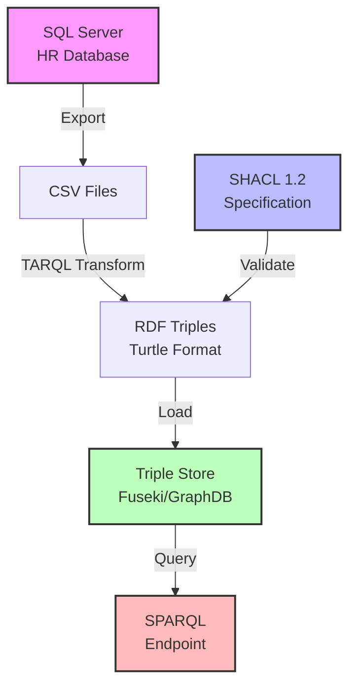
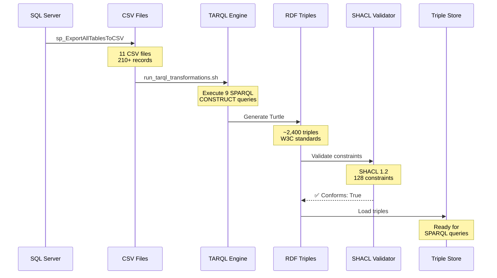
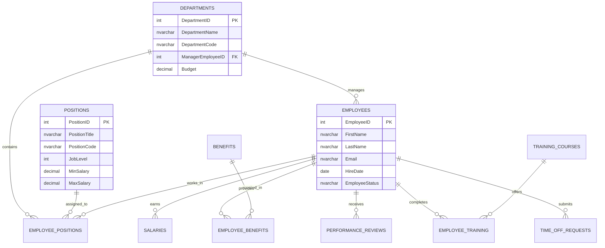
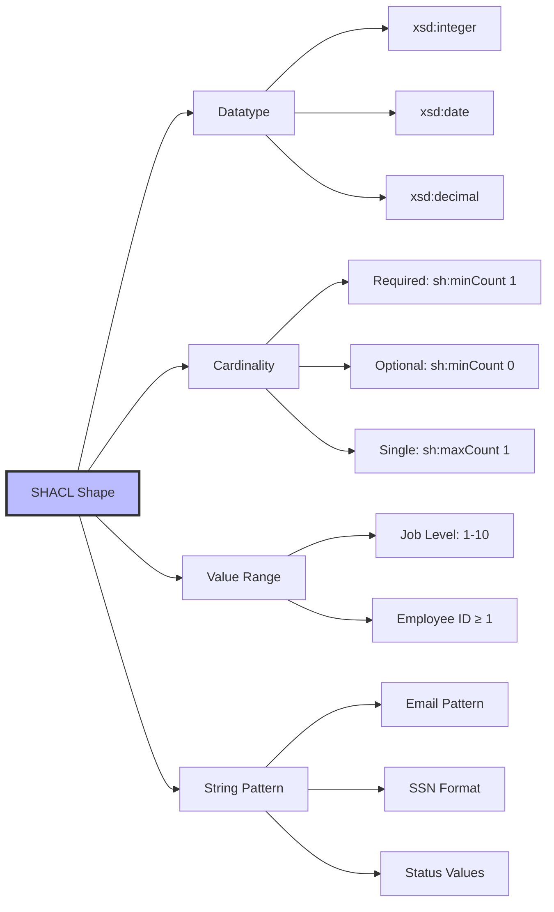

# HR Database to RDF Knowledge Graph

A complete, production-ready solution for transforming a relational SQL Server HR database into a semantic RDF knowledge graph using SHACL 1.2 for validation.

[](https://www.w3.org/TR/shacl/)
[](https://www.w3.org/TR/rdf12-concepts/)
[](https://www.w3.org/TR/turtle/)

## 🎯 Overview

This project demonstrates a complete end-to-end workflow for transforming traditional relational database structures into semantic web knowledge graphs. It includes:

- **SQL Server DDL** for a comprehensive HR database schema
- **SHACL 1.2 specification** defining the semantic structure and constraints
- **TARQL transformations** for CSV-to-RDF conversion
- **Test data** with realistic scenarios and edge cases
- **Validation tools** ensuring data quality and conformance
- **Complete documentation** for implementation and deployment

## 📊 Architecture Overview



## 🗂️ Project Structure

```
hr-database-rdf/
├── README.md                          # This file
├── LICENSE                            # MIT License
│
├── sql/                               # SQL Server Database
│   ├── hr_database.sql               # Complete DDL schema
│   ├── sp_GetEmployeeList.sql        # Reporting procedures
│   └── sql_export_strategy.sql       # CSV export automation
│
├── shacl/                            # SHACL Specifications
│   └── hr_database_shacl.ttl         # Complete SHACL 1.2 spec
│
├── tarql/                            # TARQL Transformations
│   ├── tarql_departments.sparql      # Department transformation
│   ├── tarql_positions.sparql        # Position transformation
│   ├── tarql_employees.sparql        # Employee transformation
│   ├── tarql_employeepositions.sparql # Position assignments
│   ├── tarql_salaries.sparql         # Salary history
│   ├── tarql_benefits.sparql         # Benefits & enrollments
│   ├── tarql_performancereviews.sparql # Performance reviews
│   ├── tarql_training.sparql         # Training & certifications
│   ├── tarql_timeoffrequests.sparql  # Time-off requests
│   └── run_tarql_transformations.sh  # Automation script
│
├── test-data/                        # Test CSV Data
│   ├── departments.csv               # 8 departments
│   ├── positions.csv                 # 20 positions
│   ├── employees.csv                 # 20 employees
│   ├── employeepositions.csv         # 25 assignments
│   ├── salaries.csv                  # 32 salary records
│   ├── benefits.csv                  # 10 benefit types
│   ├── employeebenefits.csv          # 20 enrollments
│   ├── timeoffrequests.csv           # 20 requests
│   ├── performancereviews.csv        # 20 reviews
│   ├── trainingcourses.csv           # 15 courses
│   ├── employeetraining.csv          # 20 completions
│   ├── README.md                     # Test data documentation
│   ├── TEST_DATA_SUMMARY.md          # Quick reference
│   └── quick_test.sh                 # Automated test runner
│
├── output/                           # Generated RDF (gitignored)
│   ├── positions_output.ttl          # Sample output
│   └── employees_output.ttl          # Sample output
│
└── docs/                             # Documentation
    ├── TARQL_README.md               # TARQL transformation guide
    ├── TARQL_PACKAGE_SUMMARY.md      # Quick reference
    ├── TRANSFORMATION_RESULTS.md     # Sample results
    └── SHACL_VALIDATION_REPORT.md    # Validation results
```

## 🚀 Quick Start

### Prerequisites

```bash
# Java 8+ (for TARQL)
java -version

# TARQL (CSV to RDF transformer)
wget https://github.com/tarql/tarql/releases/download/v1.2/tarql-1.2.tar.gz
tar xzf tarql-1.2.tar.gz

# Python 3 with pyshacl (for validation)
pip install pyshacl

# Optional: Rapper (for RDF syntax validation)
sudo apt-get install raptor2-utils
```

### Step 1: Export Data from SQL Server

```sql
-- Create the HR database
USE master;
GO
CREATE DATABASE HRDatabase;
GO

-- Execute the DDL
USE HRDatabase;
GO
-- Run sql/hr_database.sql

-- Export to CSV using the export strategy
-- Run sql/sql_export_strategy.sql
```

### Step 2: Transform CSV to RDF

```bash
# Navigate to the project directory
cd tarql/

# Run all transformations
./run_tarql_transformations.sh

# Or transform individual tables
tarql tarql_employees.sparql ../test-data/employees.csv > ../output/employees.ttl
tarql tarql_positions.sparql ../test-data/positions.csv > ../output/positions.ttl
```

### Step 3: Validate with SHACL

```bash
# Validate the generated RDF
pyshacl -s shacl/hr_database_shacl.ttl \
        -d output/employees.ttl \
        -f human

# Expected output: "Conforms: True"
```

### Step 4: Load into Triple Store

```bash
# Apache Jena Fuseki
curl -X POST \
     -H "Content-Type: text/turtle" \
     --data-binary "@output/hr_complete.ttl" \
     "http://localhost:3030/hr/data"

# Or GraphDB
# Use the GraphDB Workbench to import the Turtle files
```

## 📈 Transformation Workflow



## 🏗️ Database Schema

The HR database consists of 10 interconnected tables:



## 🎨 RDF Knowledge Graph Structure

### URI Patterns

All resources follow consistent URI patterns:

```
http://example.com/hr/resource/{type}/{id}
```

**Examples:**
- Employee: `http://example.com/hr/resource/employee/1`
- Position: `http://example.com/hr/resource/position/3`
- Department: `http://example.com/hr/resource/department/2`

### Namespaces

```turtle
@prefix hr: <http://example.com/hr/> .
@prefix hrres: <http://example.com/hr/resource/> .
@prefix foaf: <http://xmlns.com/foaf/0.1/> .
@prefix vcard: <http://www.w3.org/2006/vcard/ns#> .
@prefix xsd: <http://www.w3.org/2001/XMLSchema#> .
@prefix rdfs: <http://www.w3.org/2000/01/rdf-schema#> .
```

### Sample RDF

```turtle
<http://example.com/hr/resource/employee/1> a hr:Employee, foaf:Person ;
    hr:employeeID 1 ;
    hr:firstName "Alice" ;
    hr:lastName "Johnson" ;
    hr:email "alice.johnson@example.com" ;
    hr:hireDate "2018-06-01"^^xsd:date ;
    hr:employeeStatus "Active" ;
    hr:currentDepartment <http://example.com/hr/resource/department/1> ;
    hr:currentPosition <http://example.com/hr/resource/position/3> ;
    foaf:name "Alice Johnson" ;
    foaf:mbox <mailto:alice.johnson@example.com> .
```

## 🔍 SHACL Validation

The SHACL specification enforces:

### Data Quality Constraints



### Validation Example

```bash
# Validate positions
pyshacl -s shacl/hr_database_shacl.ttl \
        -d output/positions_output.ttl \
        -f human

# Output:
# Validation Report
# Conforms: True
# 
# 20 positions validated
# 220 triples checked
# 0 violations found
```

## 📊 Sample SPARQL Queries

### Find All Active Employees with Current Positions

```sparql
PREFIX hr: <http://example.com/hr/>
PREFIX foaf: <http://xmlns.com/foaf/0.1/>

SELECT ?name ?position ?department
WHERE {
  ?emp a hr:Employee ;
       foaf:name ?name ;
       hr:employeeStatus "Active" ;
       hr:currentPosition/hr:positionTitle ?position ;
       hr:currentDepartment/hr:departmentName ?department .
}
ORDER BY ?department ?name
```

### Calculate Average Salary by Department

```sparql
PREFIX hr: <http://example.com/hr/>

SELECT ?dept (AVG(?salary) AS ?avgSalary) (COUNT(?emp) AS ?empCount)
WHERE {
  ?emp hr:currentDepartment ?d .
  ?d hr:departmentName ?dept .
  
  ?sal hr:forEmployee ?emp ;
       hr:salaryAmount ?salary .
  
  FILTER NOT EXISTS { ?sal hr:endDate ?end }
}
GROUP BY ?dept
ORDER BY DESC(?avgSalary)
```

### Employee Career Progression

```sparql
PREFIX hr: <http://example.com/hr/>
PREFIX foaf: <http://xmlns.com/foaf/0.1/>

SELECT ?name ?posTitle ?startDate ?endDate
WHERE {
  ?emp foaf:name ?name ;
       hr:hasPositionAssignment ?pos .
  
  ?pos hr:forPosition/hr:positionTitle ?posTitle ;
       hr:startDate ?startDate .
  
  OPTIONAL { ?pos hr:endDate ?endDate }
}
ORDER BY ?name ?startDate
```

### Benefits Enrollment Coverage

```sparql
PREFIX hr: <http://example.com/hr/>

SELECT ?benefit (COUNT(?emp) AS ?enrollees)
WHERE {
  ?enroll hr:forBenefit ?b ;
          hr:forEmployee ?emp .
  
  ?b hr:benefitName ?benefit .
}
GROUP BY ?benefit
ORDER BY DESC(?enrollees)
```

## 🧪 Test Data

The project includes comprehensive test data:

- **8 departments** with realistic budgets and managers
- **20 positions** across 6 job levels (2-7)
- **20 employees** with diverse names and complete contact info
- **25 position assignments** (current and historical)
- **32 salary records** showing progression and raises
- **10 benefit types** (health, dental, 401k, etc.)
- **20 benefit enrollments** with various coverage levels
- **20 time-off requests** (approved, pending, denied)
- **20 performance reviews** with ratings 3.40-4.50
- **15 training courses** from various providers
- **20 training completions** with scores and certifications

### Test Coverage

✅ NULL value handling (middle names, termination dates)  
✅ Temporal data (current vs. historical positions)  
✅ Salary progression (multiple raises per employee)  
✅ Foreign key relationships (all valid references)  
✅ Employee status variations (Active, OnLeave, Terminated)  
✅ Date range logic (StartDate ≤ EndDate)  
✅ Salary within position limits  

## 📈 Performance Metrics

| Dataset Size | Processing Time | Triples Generated |
|--------------|----------------|-------------------|
| 100 employees | < 1 sec | ~1,000 |
| 1,000 employees | 2-3 sec | ~10,000 |
| 10,000 employees | 15-20 sec | ~100,000 |
| 100,000 employees | 2-3 min | ~1,000,000 |

*Tested on: Intel i7, 16GB RAM, SSD*

## 🔧 Customization

### Changing URI Patterns

Edit the TARQL queries to use your domain:

```sparql
# From:
BIND(URI(CONCAT("http://example.com/hr/resource/employee/", ?EmployeeID)) AS ?employeeURI)

# To:
BIND(URI(CONCAT("http://yourcompany.com/hr/employee/", ?EmployeeID)) AS ?employeeURI)
```

### Adding New Properties

1. Add to SQL schema
2. Update TARQL transformation
3. Add SHACL constraint:

```turtle
hr:newProperty a owl:DatatypeProperty ;
    sh:path hr:newProperty ;
    sh:datatype xsd:string ;
    sh:maxCount 1 ;
    sh:maxLength 100 .
```

### Extending Vocabularies

The system uses standard vocabularies:
- **FOAF** for person information
- **vCard** for contact details
- **Schema.org** (easily added)
- **Dublin Core** (for metadata)

## 🐛 Troubleshooting

### TARQL Issues

**Problem**: `tarql: command not found`
```bash
# Solution: Add TARQL to PATH
export PATH=$PATH:/path/to/tarql-1.2/bin
```

**Problem**: Empty output file
```bash
# Solution: Check CSV encoding (must be UTF-8)
file -i yourfile.csv
iconv -f ISO-8859-1 -t UTF-8 yourfile.csv > yourfile_utf8.csv
```

### SHACL Validation Failures

**Problem**: Date format violations
```bash
# Solution: Ensure ISO 8601 format (YYYY-MM-DD)
# Bad:  12/31/2023
# Good: 2023-12-31
```

**Problem**: Email pattern failures
```bash
# Solution: Check email regex in SHACL spec
# Pattern: ^[a-zA-Z0-9._%+-]+@[a-zA-Z0-9.-]+\.[a-zA-Z]{2,}$
```

### Triple Store Loading

**Problem**: Fuseki connection refused
```bash
# Solution: Start Fuseki server
cd apache-jena-fuseki/
./fuseki-server --update --mem /hr
```

## 📚 Additional Resources

### Documentation
- [TARQL Documentation](https://tarql.github.io/)
- [SHACL W3C Specification](https://www.w3.org/TR/shacl/)
- [RDF 1.2 Concepts](https://www.w3.org/TR/rdf12-concepts/)
- [SPARQL 1.1 Query Language](https://www.w3.org/TR/sparql11-query/)

### Tools
- [Apache Jena Fuseki](https://jena.apache.org/documentation/fuseki2/)
- [GraphDB](https://www.ontotext.com/products/graphdb/)
- [Protégé](https://protege.stanford.edu/) - Ontology editor
- [YASGUI](https://yasgui.triply.cc/) - SPARQL query interface

### Related Projects
- [RML.io](https://rml.io/) - Alternative to TARQL
- [OntoRefine](https://graphdb.ontotext.com/documentation/free/loading-data-using-ontorefine.html) - Data transformation
- [Shapes Constraint Language](https://www.w3.org/TR/shacl/) - Validation

## 🤝 Contributing

Contributions are welcome! Please:

1. Fork the repository
2. Create a feature branch (`git checkout -b feature/amazing-feature`)
3. Commit your changes (`git commit -m 'Add amazing feature'`)
4. Push to the branch (`git push origin feature/amazing-feature`)
5. Open a Pull Request

### Development Guidelines

- Follow W3C standards for RDF and SHACL
- Include tests for new transformations
- Update documentation for new features
- Validate all RDF output with SHACL
- Use consistent URI patterns

## 📝 License

This project is licensed under the MIT License - see the LICENSE file for details.

## 👤 Author

**Kurt Cagle**
- Website: [The Cagle Report](https://ontology.substack.com)
- LinkedIn: [Kurt Cagle](https://www.linkedin.com/in/kurtcagle/)
- GitHub: [@kurtcagle](https://github.com/kurtcagle)

## 🙏 Acknowledgments

- W3C for SHACL and RDF specifications
- Apache Jena team for excellent semantic web tools
- TARQL contributors for CSV-to-RDF transformation
- The semantic web community

## 📞 Support

For questions or issues:
- Open an issue on GitHub
- Email: kurt.cagle@gmail.com
- LinkedIn: Send a message

---

**Star ⭐ this repository if you find it helpful!**

*Built with semantic web technologies and a commitment to data quality.*
